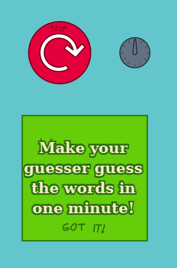

# What's That Word

Play now at Ludum Dare: http://ludumdare.com/compo/ludum-dare-37/?action=preview&uid=29177

2-Player hotseat co-op word-guessing game in HTML5.

The Hinter player opens the website on their phone / computer and
gives hints to the Guesser, who must guess the secret word based only
on the hints (No screen-looking!)

Each round lasts one minute, after which the score is tallied up.

The game has opt-in analytics - If you click "Submit" after a round,
it will send an event log to my Golang server. By default nothing
more than regular HTTP GET requests are sent to load the game assets.

The game can run from local files, however the analytics will not be sent
because of same-origin policy.

The game and assets are copyleft under the AGPLv3.
